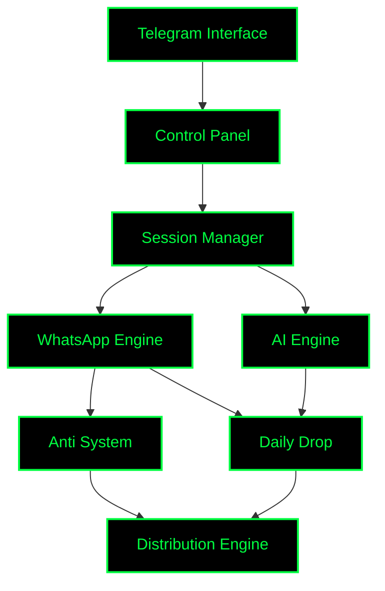

<div align="center">

```text
 ██████╗ ███╗   ███╗███████╗ ██████╗  █████╗     ██╗   ██╗ ██╗
██╔═══██╗████╗ ████║██╔════╝██╔════╝ ██╔══██╗    ██║   ██║███║
██║   ██║██╔████╔██║█████╗  ██║  ███╗███████║    ██║   ██║╚██║
██║   ██║██║╚██╔╝██║██╔══╝  ██║   ██║██╔══██║    ╚██╗ ██╔╝ ██║
╚██████╔╝██║ ╚═╝ ██║███████╗╚██████╔╝██║  ██║     ╚████╔╝  ██║
 ╚═════╝ ╚═╝     ╚═╝╚══════╝ ╚═════╝ ╚═╝  ╚═╝      ╚═══╝   ╚═╝
```

### « OMEGA-V1 • Next Generation WhatsApp Automation Platform »


<br/>

[](https://github.com/pappy999666-dotcom/omega-v1/actions)
[](https://github.com/pappy999666-dotcom/omega-v1/releases)
[](https://github.com/pappy999666-dotcom/omega-v1/stargazers)
[](https://github.com/pappy999666-dotcom/omega-v1/network/members)
[](https://github.com/pappy999666-dotcom/omega-v1/blob/main/LICENSE)
<br/>
[](https://github.com/pappy999666-dotcom/omega-v1/commits/main)
[](https://github.com/pappy999666-dotcom/omega-v1/issues)
[](https://github.com/pappy999666-dotcom/omega-v1/pulls)
[](https://github.com/pappy999666-dotcom/omega-v1)

</div>

---

### 🖥️ CYBER DASHBOARD

```text
┌──────────────────────────┬──────────────────────────┐
│ MODULE                   │ STATUS                   │
├──────────────────────────┼──────────────────────────┤
│ WhatsApp Engine          │ 🟢 ONLINE                │
│ Telegram Bridge          │ 🟢 ONLINE                │
│ AI Assistant             │ 🟢 ACTIVE                │
│ Anti System              │ 🟢 ARMED                 │
│ Daily Drop               │ 🟢 RUNNING               │
│ Media Engine             │ 🟢 READY                 │
│ Session Manager          │ 🟢 CONNECTED             │
│ Group Manager            │ 🟢 ACTIVE                │
└──────────────────────────┴──────────────────────────┘
```

---

### 🚀 FEATURE MATRIX

| Category | Feature | Support |
| :--- | :--- | :---: |
| **Connectivity** | Pairing (QR / Code) | ✅ |
| | Multi-Session Management | ⚡ |
| | Telegram Control Panel | 🚀 |
| | Web Dashboard | 🔥 |
| **Security** | AntiLink / AntiSpam | ✅ |
| | AntiBot / AntiForward | ⚡ |
| | AntiChannel / AntiNSFW | 🚀 |
| | AntiGroupCall / AntiDemote | 🔥 |
| **Moderation** | Join Approval System | ✅ |
| | Custom Welcome / Goodbye | ⚡ |
| | Warning / Kick / Ban | 🚀 |
| | Polls / BlockAll | 🔥 |
| **Intelligence** | AI Powered Commands | ✅ |
| | Pinterest / Media Search | ⚡ |
| | Wallpaper Engine | 🚀 |
| | Auto PFP Changer | 🔥 |
| **Distribution** | Daily Drop System | ✅ |
| | Godcast / Status Design | ⚡ |
| | Mass Outreach | 🚀 |
| | Hidetag / Mentions | 🔥 |

---

### 🏗️ ARCHITECTURE



---

### 🛠️ TECH STACK

<div align="center">


</div>

---

### 📂 PROJECT STRUCTURE

```text
.
├── artifacts/
│   ├── wa-bridge/          # Core WhatsApp Engine
│   │   ├── src/setup/      # Modular Setup Wizard
│   │   ├── src/whatsapp/   # Baileys Implementation
│   │   └── src/telegram/   # Telegraf Bot Handlers
│   ├── api-server/         # Web Dashboard Backend
│   └── mockup-sandbox/     # Frontend Preview Engine
├── lib/
│   ├── db/                 # Database Schemas (Drizzle)
│   ├── api-spec/           # OpenAPI Definitions
│   └── api-zod/            # Zod Validation Schemas
├── scripts/                # Deployment & Maintenance
└── setup.sh                # Initial Environment Scaffold
```

---

### 📊 PERFORMANCE METRICS

| Metric | Value |
| :--- | :--- |
| **Startup Time** | < 2 sec |
| **Concurrent Sessions** | Unlimited (Redis Scaled) |
| **Group Capacity** | 1000+ Members |
| **Memory Optimized** | ✅ |
| **Event Driven** | ✅ |
| **Multi Platform** | ✅ |

---

### 🛡️ SECURITY CORE

- **Permission Validation:** Role-based access control for all commands.
- **Session Isolation:** Cryptographically secure multi-session handling.
- **Anti Abuse:** Integrated rate-limiting and spam protection.
- **Protected Commands:** Critical actions restricted to verified sudo users.
- **Workspace Isolation:** Logical separation of user data and logs.
- **Safe Execution:** Concurrent process handling with automatic circuit breakers.

---

### 📸 SYSTEM PREVIEWS

<div align="center">

| Telegram Dashboard | Web Dashboard |
| :---: | :---: |
|  |  |

| WhatsApp Menu | Daily Drop |
| :---: | :---: |
|  |  |

</div>

---

### ⚡ INSTALLATION

#### 1. Clone the Matrix
```bash
git clone https://github.com/pappy999666-dotcom/omega-v1.git
cd omega-v1
```

#### 2. Initialize Environment
```bash
./setup
```
*This will trigger the **Modular Setup Wizard** to configure your tokens, database, and plugins.*

#### 3. Start System
```bash
pnpm install
pnpm build
pnpm start
```

---

### ⚙️ CONFIGURATION

| Key | Description | Default |
| :--- | :--- | :--- |
| `TELEGRAM_BOT_TOKEN` | Bot Father API Token | `REQUIRED` |
| `TELEGRAM_OWNER_ID` | Your Telegram UID | `REQUIRED` |
| `MONGO_URI` | MongoDB Connection String | `localhost` |
| `REDIS_URL` | Redis Connection String | `localhost` |
| `WEB_PORT` | Dashboard Access Port | `3000` |

---

### 👤 CREDITS

```text
> whoami

Name     : Pappy
Role     : Full Stack Developer
Project  : OMEGA-V1
Status   : ONLINE
Location : Matrix
Mission  : Building the next generation of WhatsApp automation.
```

---

<div align="center">

═══════════════════════════════════════════════
            ⸸ 𝕻 𝕬 𝕻 𝕻 𝖄 ×͜×
        SYSTEM STATUS : ONLINE
═══════════════════════════════════════════════

</div>
